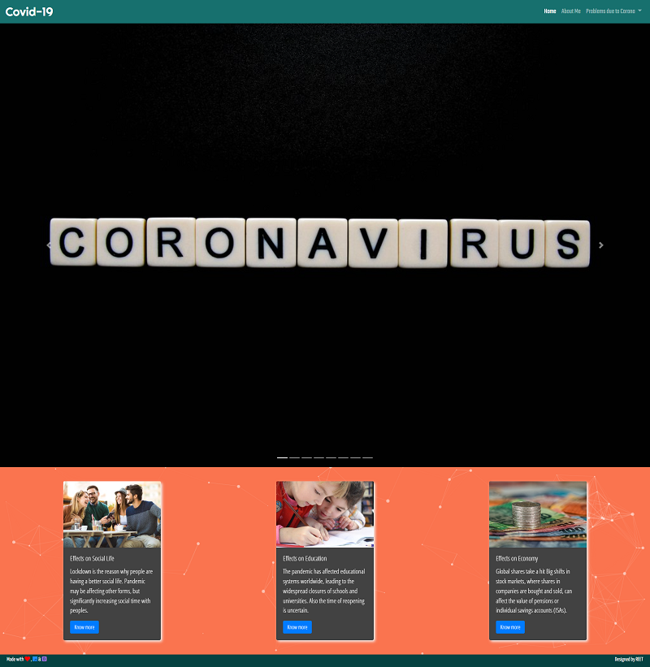

## Prototype



# CovidImpacts: Understanding the Pandemic's Effects on Economy, Education, and Social Life

Explore the profound challenges brought by the COVID-19 pandemic across key sectors, including the economy, education, and social life. Learn about the lasting impacts and steps to recovery.

## Features

- **Insights into Economic Challenges**: Discover how global and local economies were disrupted, industries impacted, and unemployment rose during the pandemic.
- **Education Disruption**: Understand the shifts in learning environments, technological challenges, and the long-term effects on students and educators.
- **Social Life Changes**: Reflect on how the pandemic reshaped social interactions, mental health, and community connections.

## Technology Stack

This project is built using:

- **HTML**: Structure and layout of the website.
- **CSS**: Styling for a responsive and visually appealing design.
- **Vanilla JavaScript**: Interactivity and dynamic content management.
- **Bootstrap**: Prebuilt components and grid system for a modern, responsive UI.

## How to Use

1. Clone this repository to your local system:
   ```bash
   git clone https://github.com/your-username/covid-impacts.git
   ```
2. Navigate to the project directory:

   ```bash
   cd covid-impacts

   ```

## Preview

- **Stay Home, Stay Safe**: Encourages responsible behavior during the pandemic while offering valuable insights.
- **Responsive Design**: Access content seamlessly on desktop, tablet, and mobile devices.

## Contributions

Contributions, issues, and feature requests are welcome! Feel free to fork the project and submit a pull request.

## License

This project is licensed under the MIT License.
